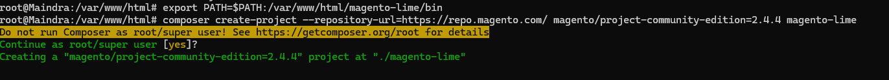
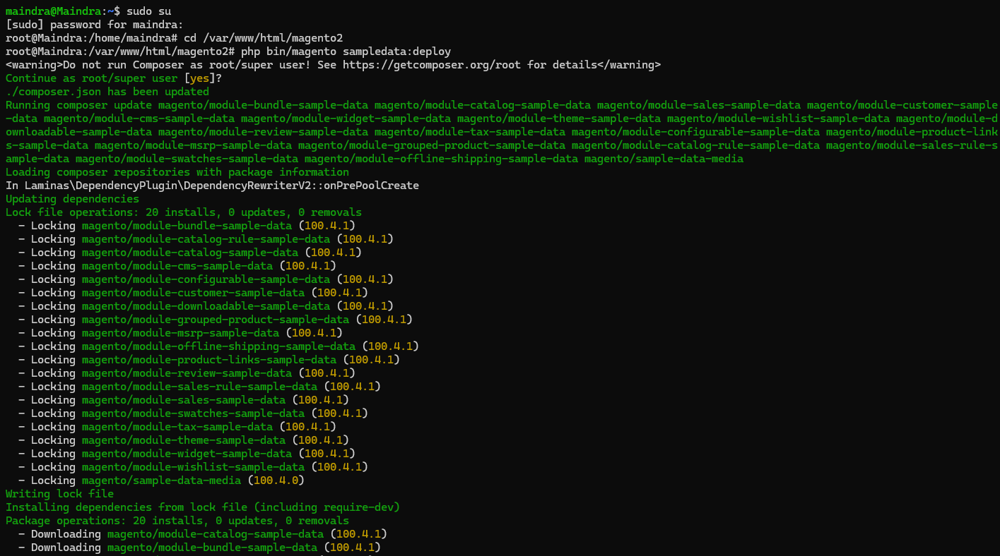
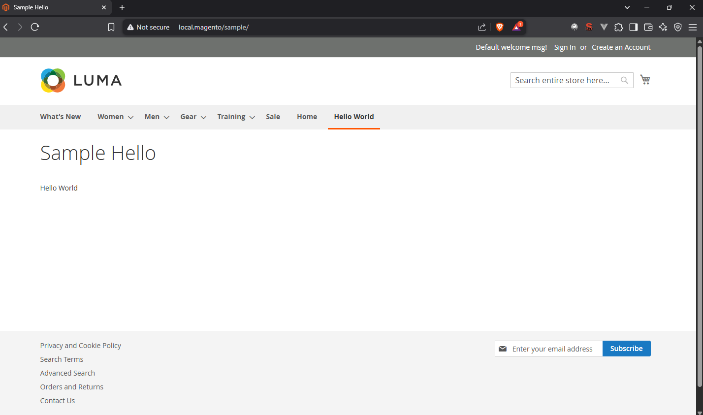
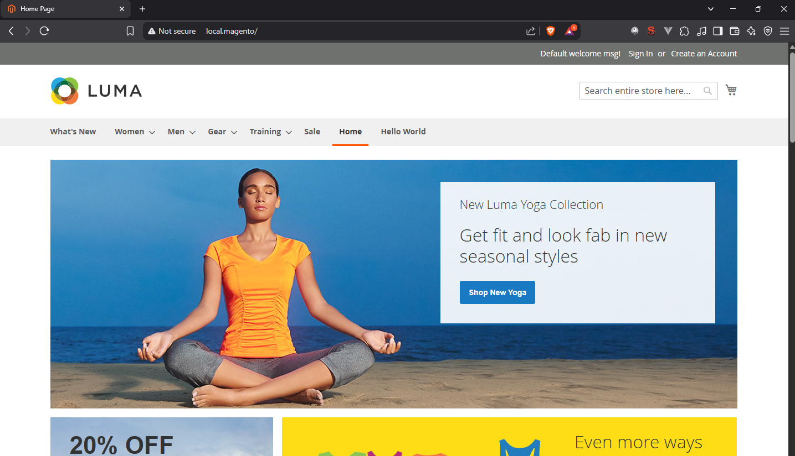
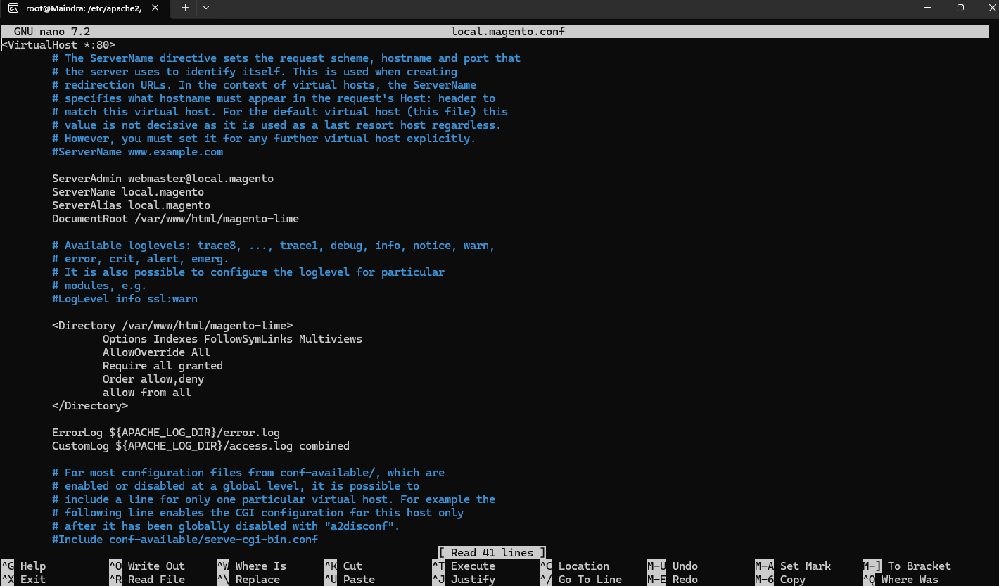
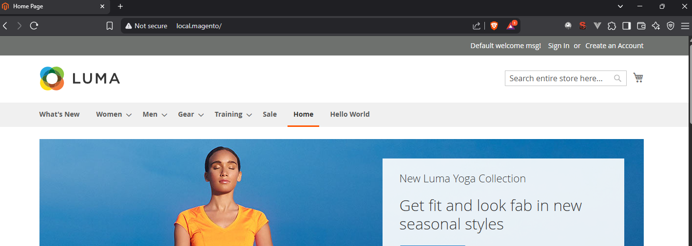
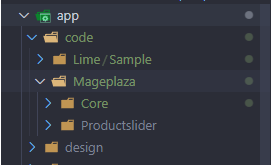
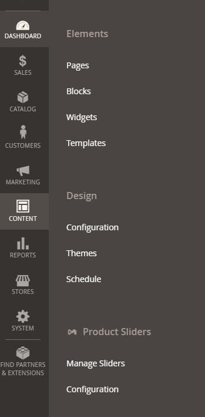
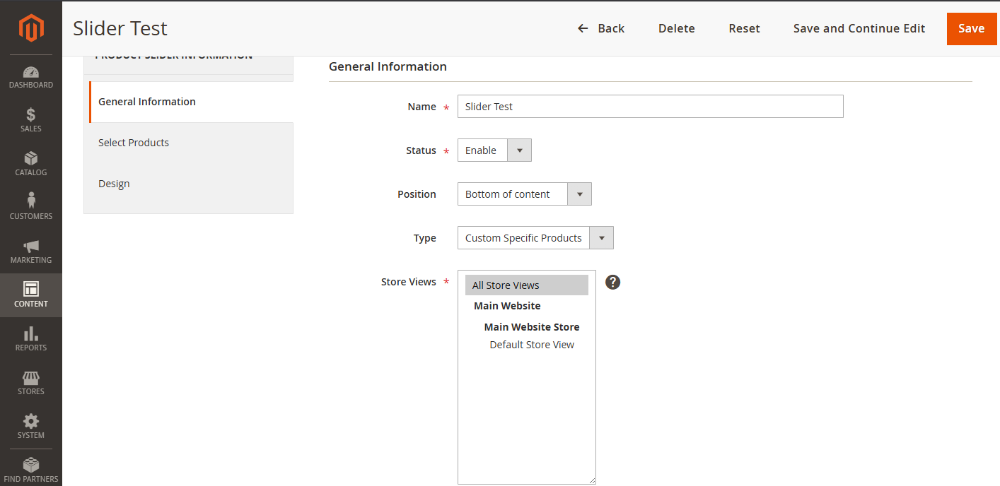
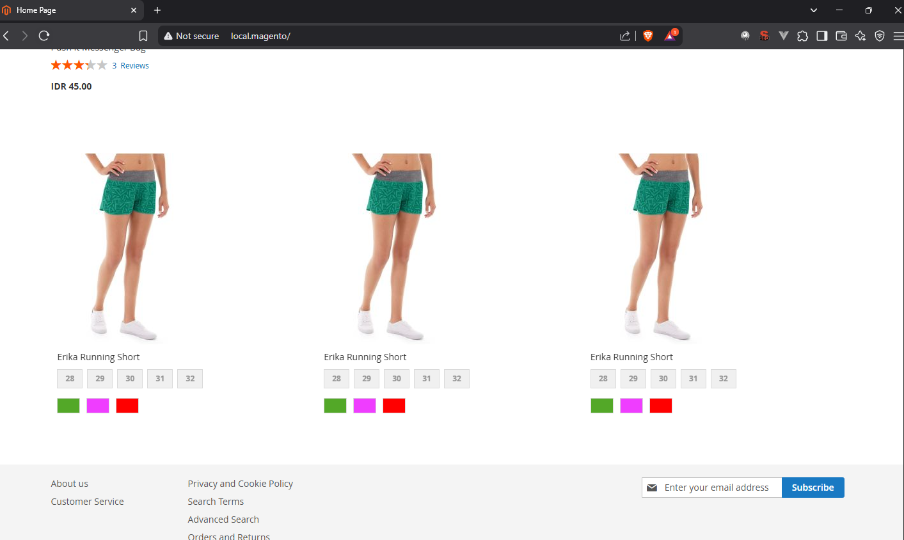

# LimeCommerce Technical Test

Pengerjaan test technical Magento dengan menggunakan WSL Ubuntu.

## Proses Instalasi

Proses instalasi Magento 2 Community Versi 2.4.4 + Sample Data menggunakan composer. Versi PHP menggunakan 7.4.

## Pembuatan Module Lime/Sample

Pembuatan halaman baru dengan menampilkan teks Hello World + dengan menu tambahan di navigation bar.

Penambahan menu Home yang mengarah pada halaman utama website (http://local.magento)

## Penambahan Custom Url

Menambahkan konfigurasi custom url menjadi http://local.magento, mulai dari setting virtual host pada WSL Ubuntu, hinggal setting hosts pada windows, supaya link dapat dikenali oleh local device.

Hasil :

## Penambahan Modul Eksternal (Slider)

Menambahan modul eksternal slider, dipasang di bagian bawah website dengan isian custom product yang telah dipilih

